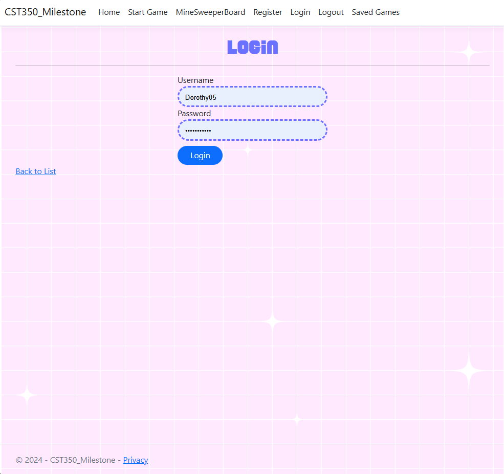
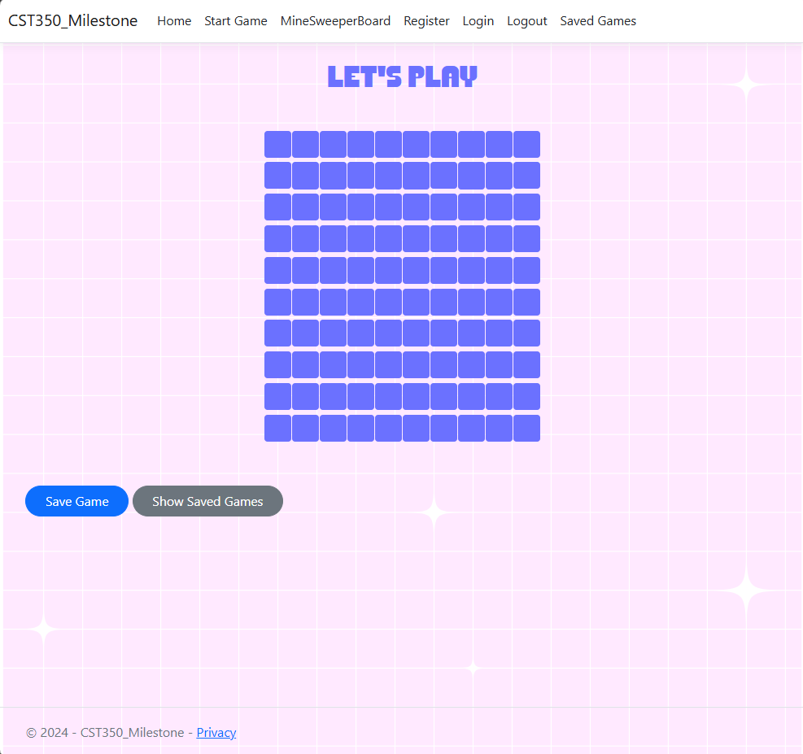

# Minesweeper Website Application 💣🚩

## Classic Logic. Modern Look. Save, Play, Repeat.

Challenge your mind with a modern take on the timeless Minesweeper game. With user authentication, game saving/loading features, and a fully responsive interface, your Minesweeper experience is better than ever.

## Application Demo 🌐

- **Login to Play**: Users must log in before starting a game. Set up your custom board by entering the number of rows, columns, and bombs.

  
  

- **Save and Load Games**: Pause your game anytime and save it. Resume right where you left off by loading from your list of saved games.

  
  

## Features ⭐️

- **Custom Board Setup**: Choose your own grid size and number of bombs for personalized difficulty  
- **User Authentication**: Secure login system to track individual progress and saved games  
- **Game State Persistence**: Save and load games from the database to continue playing later  
- **Live Game Interaction**: Click to reveal tiles, flag bombs, and clear the board—classic Minesweeper mechanics with smooth UX  
- **Responsive Design**: Fully responsive interface, optimized for both desktop and mobile devices  
- **Clean UI**: Modern interface with intuitive layouts and minimal distractions  
- **Modal-Based Controls**: Bootstrap modals for actions like starting a new game or saving progress  
- **Leaderboard (optional)**: *(If implemented)* Compare completion times or high scores with others  
- **MVC Architecture**: Organized structure with Controller, Service, and Repository layers using Spring Boot  
- **Deploy-Ready Setup**: Environment-based configuration for easy deployment to platforms like Azure or Heroku  
